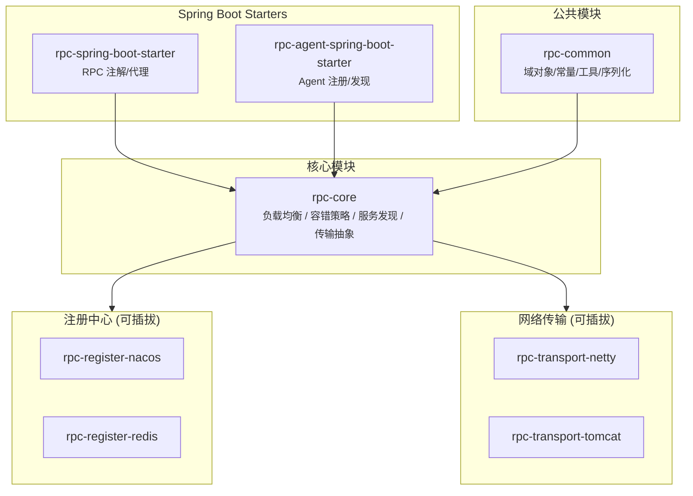
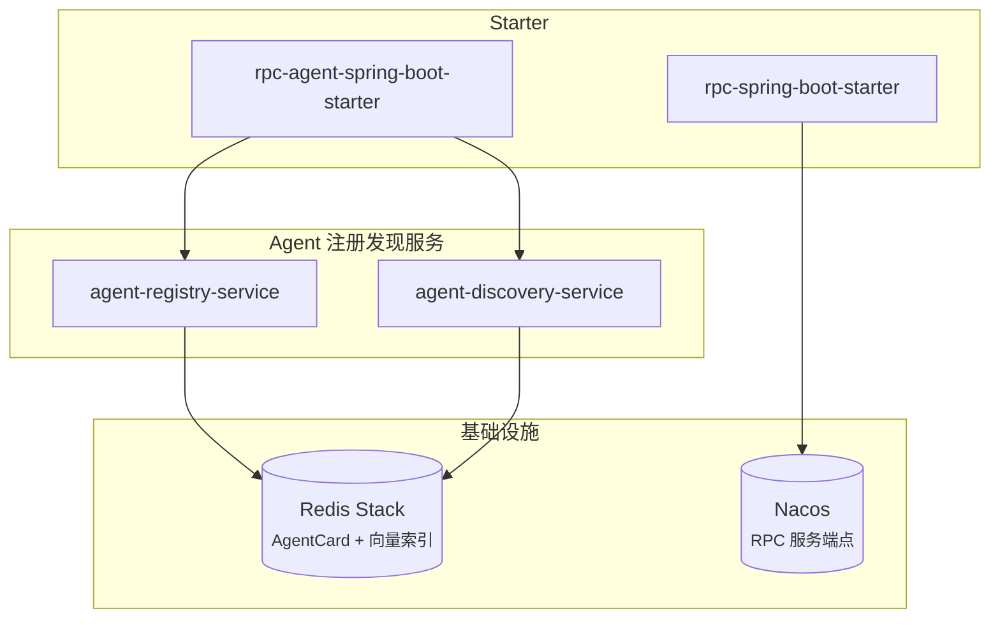
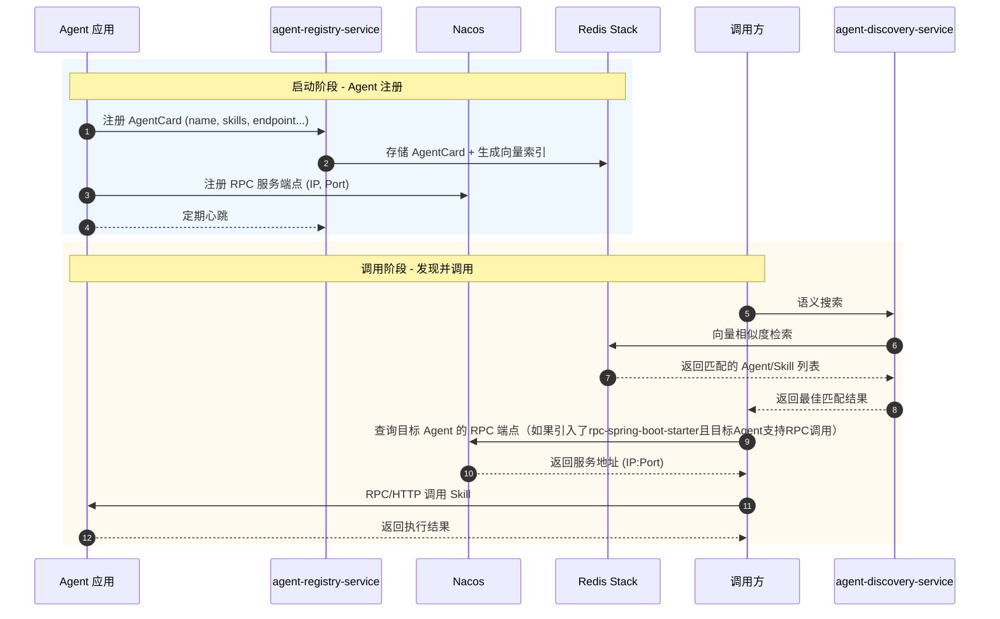

# LRPC (Light-RPC)

## 简介

LRPC 是一款轻量级、高性能的 RPC 框架，深度集成 Spring Boot，提供易用且强大的远程服务调用能力。通过模块化设计和插件化架构，LRPC 可以根据不同业务场景灵活配置，实现高可用、高性能的分布式服务通信。

**v2.0 新增 A2A（Agent-to-Agent）支持**，提供 Agent 注册、发现、语义搜索和 RPC 调用能力，助力构建智能 Agent 互联网络。

---

## 特性

- **轻量级**: 框架核心设计简洁，易于理解和使用，性能开销低
- **高扩展性**: 基于 SPI 机制、Spring 依赖注入实现插件化架构，支持多种组件自由切换
- **多协议支持**: 支持 Netty、Tomcat 等多种底层通信方式
- **多注册中心**: 灵活对接 Redis、Nacos 等多种注册中心
- **负载均衡**: 内置一致性哈希、随机等负载均衡算法
- **容错机制**: 支持 FailFast、Failover、Failsafe 多种容错策略
- **Spring Boot 集成**: 提供 Starter 组件，注解驱动，开箱即用
- **A2A 支持**: 支持 Agent 注册发现、语义搜索、Skill 调用

---

## 架构设计



---

## 模块说明

| 模块 | 说明 |
|------|------|
| `rpc-common` | 公共模块，包含域对象、常量、工具类、序列化器 |
| `rpc-core` | 核心模块，定义接口规范（负载均衡、容错、服务发现、传输） |
| `rpc-spring-boot-starter` | Spring Boot Starter，提供 RPC 注解和自动配置 |
| `rpc-agent-spring-boot-starter` | Agent Starter，提供 Agent 注册、发现、健康检查 |
| `rpc-register-nacos` | Nacos 注册中心实现 |
| `rpc-register-redis` | Redis 注册中心实现 |
| `rpc-transport-netty` | Netty 网络传输实现 |
| `rpc-transport-tomcat` | Tomcat 网络传输实现 |

---

## 快速开始

### 一、RPC 使用

#### 1. Maven 依赖

```xml
<!-- LRPC Spring Boot Starter（必须） -->
<dependency>
    <groupId>space.ruiwang</groupId>
    <artifactId>rpc-spring-boot-starter</artifactId>
    <version>1.0-SNAPSHOT</version>
</dependency>

<!-- 注册中心（二选一） -->
<dependency>
    <groupId>space.ruiwang</groupId>
    <artifactId>rpc-register-nacos</artifactId>
    <version>1.0-SNAPSHOT</version>
</dependency>
<!-- 或 Redis 注册中心
<dependency>
    <groupId>space.ruiwang</groupId>
    <artifactId>rpc-register-redis</artifactId>
    <version>1.0-SNAPSHOT</version>
</dependency>
-->

<!-- 传输层（二选一） -->
<dependency>
    <groupId>space.ruiwang</groupId>
    <artifactId>rpc-transport-netty</artifactId>
    <version>1.0-SNAPSHOT</version>
</dependency>
<!-- 或 Tomcat 传输
<dependency>
    <groupId>space.ruiwang</groupId>
    <artifactId>rpc-transport-tomcat</artifactId>
    <version>1.0-SNAPSHOT</version>
</dependency>
-->

<!-- 共享服务接口（Provider 和 Consumer 共用） -->
<dependency>
    <groupId>space.ruiwang</groupId>
    <artifactId>rpc-interface</artifactId>
    <version>1.0-SNAPSHOT</version>
</dependency>
```

#### 2. Provider 端

```java
// 启动类
@SpringBootApplication
@EnableProviderRpc
public class RpcProviderApplication {
    public static void main(String[] args) {
        SpringApplication.run(RpcProviderApplication.class, args);
    }
}

// 服务实现
@RpcService(serviceVersion = "1.0")
public class TestServiceImpl implements TestService {
    @Override
    public String calc(Integer a, Integer b) {
        return "结果: " + (a + b);
    }
}
```

#### 3. Consumer 端

```java
// 启动类
@SpringBootApplication
@EnableConsumerRpc
public class RpcConsumerApplication {
    public static void main(String[] args) {
        SpringApplication.run(RpcConsumerApplication.class, args);
    }
}

// 调用服务
@RestController
public class TestController {
    @RpcReference(serviceVersion = "1.0", tolerant = FaultTolerantStrategies.FAIL_OVER)
    private TestService testService;

    @GetMapping("/test")
    public String test(Integer a, Integer b) {
        return testService.calc(a, b);
    }
}
```

#### 4. 配置文件

**Provider:**
```yaml
server:
  port: 10001

spring:
  application:
    name: rpc-provider

# Nacos 配置（使用 Nacos 注册中心时）
nacos:
  server-addr: localhost:8848
  username: nacos
  password: nacos

# Redis 配置（使用 Redis 注册中心时）
# redis:
#   address: "redis://localhost:6379"
#   password: ""
#   database: 0

# LRPC Provider 配置
lrpc:
  provider:
    address: localhost
    port: 8999
```

**Consumer:**
```yaml
server:
  port: 20001

spring:
  application:
    name: rpc-consumer

nacos:
  server-addr: localhost:8848
  username: nacos
  password: nacos
```

#### 5. JVM 参数

启动时添加以下 JVM 参数：

```bash
--add-opens java.base/java.lang=ALL-UNNAMED
--add-opens java.base/jdk.internal.misc=ALL-UNNAMED
--add-opens java.base/java.nio=ALL-UNNAMED
--add-opens java.base/sun.nio.ch=ALL-UNNAMED
-Dio.netty.tryReflectionSetAccessible=true
```

---

### 二、A2A (Agent-to-Agent) 使用

本框架实现了A2A协议，支持Agent之间的互联互通，提供基于语义的 Agent/Skill 发现和调用能力。

#### 架构图



#### 调用流程



**双重注册机制：**
- **agent-registry-service → Redis Stack**: 存储完整的 AgentCard 元数据，支持向量语义搜索
- **rpc-spring-boot-starter → Nacos**: 存储 RPC 服务端点（IP、端口），用于负载均衡和服务发现

#### 1. Maven 依赖

```xml
<!-- Agent Spring Boot Starter -->
<dependency>
    <groupId>space.ruiwang</groupId>
    <artifactId>rpc-agent-spring-boot-starter</artifactId>
    <version>1.0-SNAPSHOT</version>
</dependency>

<!-- RPC Spring Boot Starter（支持 RPC 调用） -->
<dependency>
    <groupId>space.ruiwang</groupId>
    <artifactId>rpc-spring-boot-starter</artifactId>
    <version>1.0-SNAPSHOT</version>
</dependency>

<!-- Nacos 注册中心 -->
<dependency>
    <groupId>space.ruiwang</groupId>
    <artifactId>rpc-register-nacos</artifactId>
    <version>1.0-SNAPSHOT</version>
</dependency>

<!-- Netty 传输 -->
<dependency>
    <groupId>space.ruiwang</groupId>
    <artifactId>rpc-transport-netty</artifactId>
    <version>1.0-SNAPSHOT</version>
</dependency>
```

#### 2. Agent 启动类

```java
@SpringBootApplication
@EnableAgentConsumerRpc  // 启用 Agent RPC 消费能力
@EnableAgentProviderRpc  // 启用 Agent RPC 提供能力
@EnableAgent          // 启用 Agent 注册/发现
public class MyAgentApplication {
    public static void main(String[] args) {
        SpringApplication.run(MyAgentApplication.class, args);
    }
}
```

#### 3. AgentCard 配置

**方式一：通过 Bean 配置（优先）**

```java
@Configuration
public class AgentConfig {
    @Bean
    public AgentCard agentCard() {
        AgentCard agent = new AgentCard();
        agent.setName("my-agent");
        agent.setDescription("我的智能 Agent，提供 XXX 能力");
        agent.setVersion("1.0");
        
        AgentProvider provider = new AgentProvider();
        provider.setOrganization("my-org");
        provider.setUrl("https://example.com");
        agent.setProvider(provider);
        
        AgentEndpoint endpoint = new AgentEndpoint();
        endpoint.setUrl("http://localhost:18082/agent");
        endpoint.setTransport(List.of("HTTP", "RPC"));
        agent.setEndpoint(endpoint);
        
        // 配置 Skills
        SkillCard skill = new SkillCard();
        skill.setId("my.skill");
        skill.setName("my-skill");
        skill.setDescription("技能描述");
        skill.setVersion("1.0");
        skill.setTags(List.of("tag1", "tag2"));
        agent.setSkills(List.of(skill));
        
        return agent;
    }
}
```

**方式二：通过 agentcard.json 配置**

在 `src/main/resources/agentcard.json` 中：

```json
{
  "name": "my-agent",
  "description": "我的智能 Agent，提供 XXX 能力",
  "version": "1.0",
  "provider": {
    "organization": "my-org",
    "url": "https://example.com"
  },
  "endpoint": {
    "url": "http://localhost:18082/agent",
    "transport": ["HTTP", "RPC"]
  },
  "defaultInputModes": ["application/json"],
  "defaultOutputModes": ["application/json"],
  "skills": [
    {
      "id": "my.skill",
      "name": "my-skill",
      "description": "技能描述",
      "version": "1.0",
      "tags": ["tag1", "tag2"]
    }
  ]
}
```

#### 4. Skill 执行器

```java
@Component
public class MySkillExecutor implements AgentSkillExecutor {
    @Override
    public AgentSkillInvokeResponse execute(AgentSkillInvokeRequest request) {
        String skillId = request.getSkillId();
        String input = request.getQuery();
        
        // 根据 skillId 执行不同的逻辑
        String result = switch (skillId) {
            case "my.skill" -> processMySkill(input);
            default -> throw new IllegalArgumentException("Unknown skill: " + skillId);
        };
        
        AgentSkillInvokeResponse response = new AgentSkillInvokeResponse();
        response.setSkillId(skillId);
        response.setResult(result);
        return response;
    }
}
```

#### 5. 配置文件

```yaml
server:
  port: 18082

spring:
  application:
    name: my-agent

# LRPC 配置
lrpc:
  provider:
    port: 19082
  agent:
    enabled: true
    registry-base-url: http://localhost:18080    # agent-registry-service 地址
    discovery-base-url: http://localhost:18081   # agent-discovery-service 地址

# Nacos 配置
nacos:
  server-addr: localhost:8848
  username: nacos
  password: nacos

# DashScope 配置（用于 LLM 能力）
dashscope:
  api-key: ${API_KEY_DASH_SCOPE}
  chat-model: qwen-plus
```

#### 6. 启动 Agent 基础服务

在运行 Agent 之前，需先启动：

1. **Redis Stack** - 存储 AgentCard 和向量索引
2. **Nacos** - RPC 服务注册发现
3. **agent-registry-service** - Agent 注册服务
4. **agent-discovery-service** - Agent 发现服务

---

## 注解说明

### RPC 注解

| 注解 | 说明 | 属性 |
|------|------|------|
| `@EnableProviderRpc` | 启用 RPC Provider | - |
| `@EnableConsumerRpc` | 启用 RPC Consumer | - |
| `@RpcService` | 标记 RPC 服务实现类 | `service`: 接口类<br>`serviceVersion`: 版本<br>`ttl`: 有效期(ms) |
| `@RpcReference` | 注入 RPC 服务代理 | `serviceVersion`: 版本<br>`loadBalancer`: 负载均衡策略<br>`tolerant`: 容错策略<br>`timeout`: 超时(ms)<br>`retryCount`: 重试次数 |

### Agent 注解

| 注解 | 说明 |
|------|------|
| `@EnableRpcAgent` | 启用 Agent 注册/发现能力 |
| `@EnableAgentProviderRpc` | 启用 Agent RPC Provider（组合了 @EnableProviderRpc） |
| `@EnableAgentConsumerRpc` | 启用 Agent RPC Consumer（组合了 @EnableConsumerRpc） |

---

## 负载均衡策略

| 策略 | 常量 | 说明 |
|------|------|------|
| 一致性哈希 | `LoadBalancerStrategies.CONSISTENT_HASHING` | 默认策略，相同请求路由到相同节点 |
| 随机 | `LoadBalancerStrategies.RANDOM` | 随机选择可用节点 |

---

## 容错策略

| 策略 | 常量 | 说明 |
|------|------|------|
| 快速失败 | `FaultTolerantStrategies.FAIL_FAST` | 默认策略，失败立即抛出异常 |
| 故障转移 | `FaultTolerantStrategies.FAIL_OVER` | 失败后重试其他节点 |
| 静默失败 | `FaultTolerantStrategies.FAIL_SAFE` | 失败后返回空结果，不抛异常 |

---

## 示例项目

### lrpc-demo（传统 RPC 示例）

| 模块 | 说明 | 端口 |
|------|------|------|
| `rpc-interface` | 共享服务接口 | - |
| `rpc-provider` | 服务提供者 | 10001 |
| `rpc-provider2` | 服务提供者2 | 10002 |
| `rpc-consumer` | 服务消费者 | 20001 |

### a2a-demo（Agent 互联示例）

| 模块 | Agent 名称 | 说明 | 端口 |
|------|-----------|------|------|
| `rpc-agent1` | travel-planner | 旅行规划 Agent | 18082 |
| `rpc-agent2` | travel-info | 旅行信息 Agent（景点/天气/路线） | 18083 |
| `rpc-agent3` | entertainment-trends | 娱乐趋势 Agent（音乐/电影） | 18084 |
| `rpc-agent4` | book-recommender | 图书推荐 Agent | 18085 |

### Agent 服务

| 服务 | 说明 | 端口 |
|------|------|------|
| `agent-registry-service` | Agent 注册与索引构建（Redis Stack） | 18080 |
| `agent-discovery-service` | Agent/Skill 语义发现（Redis Stack + DashScope） | 18081 |

---

## 配置参考

### Nacos 配置

```yaml
nacos:
  server-addr: localhost:8848
  username: nacos
  password: nacos
```

### Redis 配置

```yaml
redis:
  address: "redis://localhost:6379"
  password: ""
  database: 0
  connectionMinimumIdleSize: 5
  connectionPoolSize: 15
  connectTimeout: 10000
  timeout: 5000
  retryAttempts: 3
  retryInterval: 1500
```

### LRPC Provider 配置

```yaml
lrpc:
  provider:
    address: localhost  # 服务地址
    port: 8999          # RPC 端口
```

### Agent 配置

```yaml
lrpc:
  agent:
    enabled: true
    registry-base-url: http://localhost:18080
    discovery-base-url: http://localhost:18081
    heartbeat-interval-seconds: 30
```
